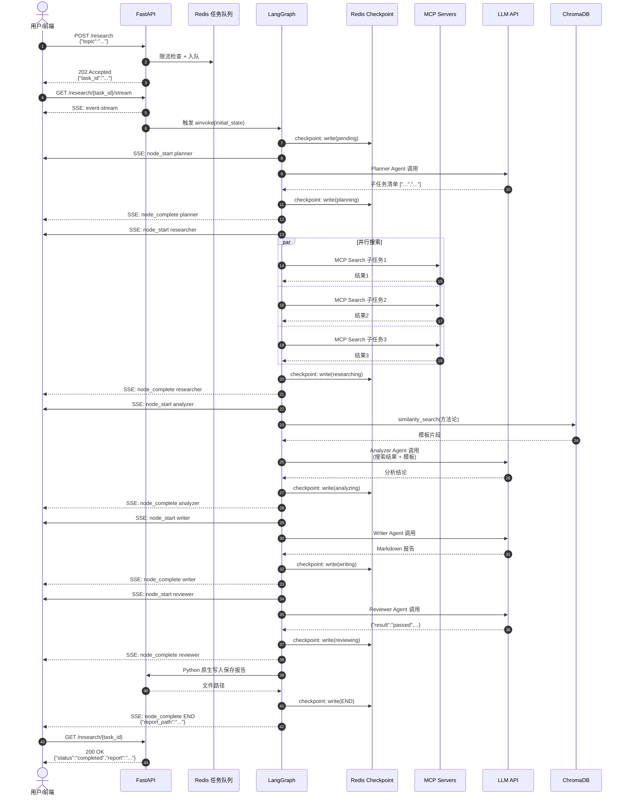
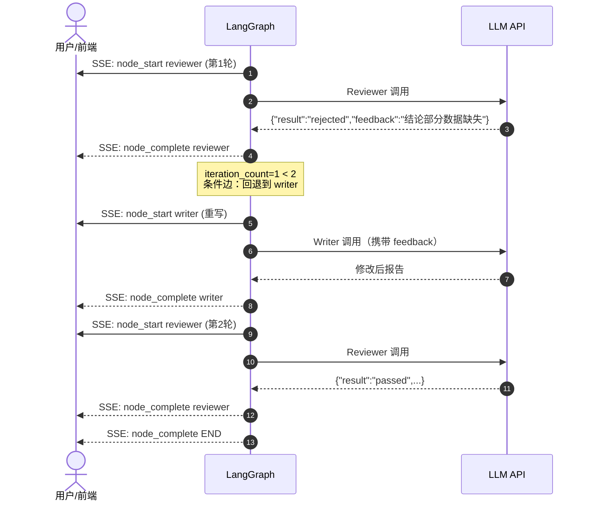
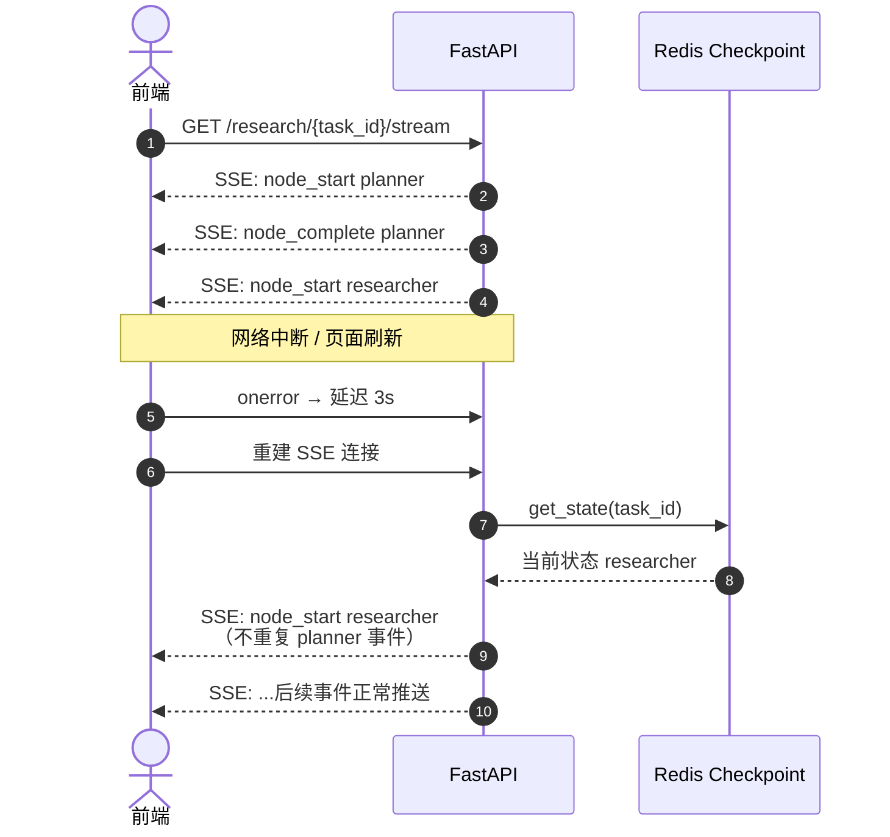

# 智能深度研究助手 — 接口文档

> **版本**：v1.0  
> **协议**：HTTP/1.1（SSE 端点需支持）  
> **Base URL**：`http://localhost:8000`  
> **数据格式**：JSON（请求/响应体），SSE（事件流）  
> **编码**：UTF-8

---

## 一、模块划分

| 模块 | 职责 | 接口数量 |
|------|------|---------|
| **系统模块** | 服务健康探测、依赖就绪检查 | 1 |
| **任务管理模块** | 研究任务全生命周期：提交、进度流式推送、状态查询 | 3 |

---

## 二、枚举与常量定义

### 2.1 任务状态（TaskStatus）

```typescript
type TaskStatus = 
  | "pending"       // 已入队，等待执行
  | "planning"      // Planner 节点运行中
  | "researching"   // Researcher 节点并行搜索中
  | "analyzing"     // Analyzer 节点分析整合中
  | "writing"       // Writer 节点撰写报告中
  | "reviewing"     // Reviewer 节点审核中
  | "completed"     // 流程结束（通过或强制结束）
  | "failed";       // 执行过程中发生不可恢复错误
```

### 2.2 节点类型（NodeType）

```typescript
type NodeType = 
  | "planner"
  | "researcher"
  | "analyzer"
  | "writer"
  | "reviewer"
  | "save_report"
  | "END";
```

### 2.3 SSE 事件类型（SSEEventType）

```typescript
type SSEEventType = 
  | "node_start"     // 节点开始执行
  | "node_complete"  // 节点执行完成
  | "heartbeat"      // 保活心跳（30秒间隔）
  | "error";         // 执行异常（流程终止）
```

### 2.4 审核结果（ReviewResult）

```typescript
type ReviewResult = "passed" | "rejected";
```

---

## 三、全局错误码

| 错误码 | 含义 | 触发场景 |
|--------|------|---------|
| `2000` | 成功 | 所有正常响应 |
| `4001` | 请求参数错误 | JSON 格式非法、字段类型不匹配 |
| `4002` | 主题内容非法 | `topic` 为空或长度超过 500 字符 |
| `4291` | 并发限流 | 全局同时执行的研究任务数已达上限（默认 5） |
| `4041` | 任务不存在 | `task_id` 对应的任务未找到 |
| `4091` | 任务重复提交 | 同一主题在 10 秒内重复提交 |
| `5001` | 内部服务错误 | LLM 调用失败、LangGraph 状态机异常 |
| `5002` | 外部依赖错误 | MCP Server 断开、搜索 API 超时、ChromaDB 不可用 |
| `5031` | 服务未就绪 | Redis 或 ChromaDB 连接未建立 |

**错误响应统一结构**：

```json
{
  "code": 4291,
  "message": "并发研究任务数已达上限，请稍后再试",
  "detail": { "max_concurrent": 5, "current_running": 5 }
}
```

---

## 四、系统模块

### 4.1 健康检查

#### 基础信息

| 项目 | 内容 |
|------|------|
| **接口路径** | `GET /health` |
| **功能描述** | 探测服务及核心依赖（Redis、ChromaDB）是否就绪 |
| **调用场景** | 容器启动探针、前端页面加载前预检、调试 |

#### 请求定义

- **路径参数**：无
- **Query 参数**：无
- **请求头**：无特殊要求
- **请求体**：无

#### 响应定义

**成功响应** — `200 OK`

```json
{
  "code": 2000,
  "data": {
    "status": "healthy",
    "redis": "connected",
    "chromadb": "connected",
    "mcp_servers": ["iqs-search"]
  }
}
```

**失败响应** — `503 Service Unavailable`

```json
{
  "code": 5031,
  "message": "服务未就绪",
  "detail": {
    "redis": "disconnected",
    "chromadb": "connected",
    "mcp_servers": ["iqs-search"]
  }
}
```

> **规则**：只要 Redis 或 ChromaDB 任一未连接，返回 `503`；MCP Server 缺失不入队但可返回 `200`（前端仅提示警告）。

#### cURL 测试

```bash
curl -i http://localhost:8000/health
```

---

## 五、任务管理模块

### 5.1 提交研究任务

#### 基础信息

| 项目 | 内容 |
|------|------|
| **接口路径** | `POST /research` |
| **功能描述** | 接收用户研究主题，生成唯一任务 ID，入队后异步触发 LangGraph 执行 |
| **调用场景** | 用户在首屏输入主题并点击提交 |

#### 请求定义

- **路径参数**：无
- **Query 参数**：无
- **请求头**：

| 头部字段 | 必填 | 说明 |
|---------|------|------|
| `Content-Type` | 是 | 固定值 `application/json` |

- **请求体**：

```json
{
  "topic": "2026 年 AI Agent 开发框架对比调研"
}
```

| 字段 | 类型 | 必填 | 校验规则 |
|------|------|------|---------|
| `topic` | `string` | 是 | 非空，去除首尾空格后长度 `1~500` |

#### 响应定义

**成功响应** — `202 Accepted`

```json
{
  "code": 2000,
  "data": {
    "task_id": "550e8400-e29b-41d4-a716-446655440000",
    "status": "pending",
    "stream_url": "/research/550e8400-e29b-41d4-a716-446655440000/stream"
  }
}
```

| 字段 | 类型 | 说明 |
|------|------|------|
| `task_id` | `string` | UUID v4，全局唯一，后续所有操作凭此 ID |
| `status` | `TaskStatus` | 初始值固定为 `"pending"` |
| `stream_url` | `string` | SSE 流式端点相对路径，前端可直接拼接 Base URL 使用 |

**失败响应**

| HTTP 状态码 | 错误码 | 触发条件 |
|------------|--------|---------|
| `400` | `4001` | 请求体非合法 JSON |
| `400` | `4002` | `topic` 为空或超过 500 字符 |
| `429` | `4291` | Redis Sliding Window 计数器超限 |
| `409` | `4091` | 同一客户端 IP 在 10 秒内提交相同主题（去重窗口） |
| `503` | `5031` | 服务依赖未就绪（Redis / ChromaDB 断开） |
| `500` | `5001` | LangGraph 编译器异常、任务入队失败 |

```json
// 4002 示例
{
  "code": 4002,
  "message": "主题内容非法",
  "detail": { "field": "topic", "constraint": "1~500 chars", "actual": 0 }
}
```

```json
// 4291 示例
{
  "code": 4291,
  "message": "并发研究任务数已达上限",
  "detail": { "max_concurrent": 5, "current_running": 5, "retry_after": 120 }
}
```

#### cURL 测试

```bash
# 正常提交
curl -X POST http://localhost:8000/research \
  -H "Content-Type: application/json" \
  -d '{"topic":"2026年AI Agent开发框架对比调研"}'

# 主题过长（应返回 4002）
curl -X POST http://localhost:8000/research \
  -H "Content-Type: application/json" \
  -d '{"topic":"'$(python -c "print('A'*501)")'"}'
```

---

### 5.2 SSE 流式获取进度

#### 基础信息

| 项目 | 内容 |
|------|------|
| **接口路径** | `GET /research/{task_id}/stream` |
| **功能描述** | 通过 Server-Sent Events 实时推送 LangGraph 各节点执行状态 |
| **调用场景** | 前端进入进度监控页后，建立长连接监听任务执行过程 |

#### 请求定义

- **路径参数**：

| 参数 | 类型 | 必填 | 校验规则 |
|------|------|------|---------|
| `task_id` | `string` | 是 | UUID v4 格式 |

- **Query 参数**：无
- **请求头**：

| 头部字段 | 必填 | 说明 |
|---------|------|------|
| `Accept` | 是 | 固定值 `text/event-stream` |
| `Cache-Control` | 否 | 建议设置 `no-cache`，防止代理缓存 |

- **请求体**：无

#### 响应定义

**成功响应** — `200 OK`，`Content-Type: text/event-stream`

SSE 事件格式：每条事件以 `data:` 开头，以两个换行符结束。事件为 JSON 字符串。

```
data: {"event_type":"node_start","task_id":"550e...","node":"planner","timestamp":"2026-05-04T12:00:00Z"}

data: {"event_type":"node_complete","task_id":"550e...","node":"planner","output":{"plan":["子任务1","子任务2","子任务3"]},"timestamp":"2026-05-04T12:00:05Z"}

data: {"event_type":"node_start","task_id":"550e...","node":"researcher","timestamp":"2026-05-04T12:00:06Z"}

data: {"event_type":"heartbeat","task_id":"550e...","timestamp":"2026-05-04T12:00:36Z"}

data: {"event_type":"node_complete","task_id":"550e...","node":"reviewer","output":{"result":"passed","feedback":"报告结构完整，逻辑清晰"},"timestamp":"2026-05-04T12:02:00Z"}

data: {"event_type":"node_complete","task_id":"550e...","node":"END","output":{"report_path":"/reports/550e....md"},"timestamp":"2026-05-04T12:02:01Z"}
```

**SSE 事件结构**

| 字段 | 类型 | 说明 |
|------|------|------|
| `event_type` | `SSEEventType` | 事件类型 |
| `task_id` | `string` | 任务 ID |
| `node` | `NodeType` | 当前执行的节点名（`heartbeat` 无此字段） |
| `output` | `object` | 节点输出（仅 `node_complete` 携带，不同节点结构不同） |
| `timestamp` | `string` | ISO 8601 格式 UTC 时间 |

**各节点 `output` 结构**

```typescript
// planner 完成
{ "plan": string[] }              // 子任务清单，3~5 项

// researcher 完成
{ "search_results": Record<string, string[]> }  // key=子任务, value=搜索结果摘要列表

// analyzer 完成
{ "analysis": string }            // 分析结论文本

// writer 完成
{ "report": string }              // Markdown 格式报告全文

// reviewer 完成
{ "result": ReviewResult, "feedback": string }  // passed/rejected + 审核意见

// END 完成
{ "report_path": string, "iteration_count": number }  // 文件路径或 OSS 下载链接 + 实际审核轮数
```

**异常事件** — `event_type: "error"`

```
data: {"event_type":"error","task_id":"550e...","node":"researcher","error_code":5002,"message":"MCP Search 调用超时","timestamp":"2026-05-04T12:01:00Z"}
```

> **规则**：发生 `error` 事件后，服务端立即关闭 SSE 连接。前端收到后应提示用户任务失败，并引导至报告页查看已生成的部分结果（如有）。

**失败响应**（非 SSE 场景）

| HTTP 状态码 | 错误码 | 触发条件 |
|------------|--------|---------|
| `404` | `4041` | `task_id` 不存在 |
| `400` | `4001` | `task_id` 格式非法 |

#### 断线重连策略

- 前端在 `EventSource.onerror` 中检测连接断开。
- 延迟 **3 秒**后自动重连（`new EventSource(...)`）。
- 重连后服务端从当前最新状态继续推送（不重复已发送的 `node_complete` 事件）。
- 若任务已结束（`END` 或 `error`），重连后立即收到最终事件并再次关闭连接。

#### cURL 测试

```bash
# SSE 流式监听（终端逐行输出）
curl -N \
  -H "Accept: text/event-stream" \
  -H "Cache-Control: no-cache" \
  http://localhost:8000/research/550e8400-e29b-41d4-a716-446655440000/stream

# 配合 jq 解析 JSON
curl -N \
  -H "Accept: text/event-stream" \
  http://localhost:8000/research/550e8400-e29b-41d4-a716-446655440000/stream | \
  while read line; do
    [[ "$line" == data:* ]] && echo "${line#data: }" | jq .
  done
```

---

### 5.3 查询任务状态与结果

#### 基础信息

| 项目 | 内容 |
|------|------|
| **接口路径** | `GET /research/{task_id}` |
| **功能描述** | 查询指定任务的当前执行状态、进度与最终结果。支持断点续传后查询恢复状态。 |
| **调用场景** | 页面刷新后兜底查询、SSE 断线后恢复当前视图、报告页加载时获取内容 |

#### 请求定义

- **路径参数**：

| 参数 | 类型 | 必填 | 校验规则 |
|------|------|------|---------|
| `task_id` | `string` | 是 | UUID v4 格式 |

- **Query 参数**：无
- **请求头**：无特殊要求
- **请求体**：无

#### 响应定义

**执行中 — 成功响应** `200 OK`

```json
{
  "code": 2000,
  "data": {
    "task_id": "550e8400-e29b-41d4-a716-446655440000",
    "topic": "2026 年 AI Agent 开发框架对比调研",
    "status": "analyzing",
    "current_node": "analyzer",
    "progress": 60,
    "iteration_count": 0,
    "report": null,
    "report_path": null,
    "created_at": "2026-05-04T12:00:00Z",
    "updated_at": "2026-05-04T12:01:30Z"
  }
}
```

**已完成 — 成功响应** `200 OK`

```json
{
  "code": 2000,
  "data": {
    "task_id": "550e8400-e29b-41d4-a716-446655440000",
    "topic": "2026 年 AI Agent 开发框架对比调研",
    "status": "completed",
    "current_node": "END",
    "progress": 100,
    "iteration_count": 1,
    "report": "# 2026 年 AI Agent 开发框架对比调研\n\n## 一、概述\n...",
    "report_path": "https://your-bucket.oss-cn-hangzhou.aliyuncs.com/reports/550e8400-e29b-41d4-a716-446655440000.md?OSSAccessKeyId=...",
    "created_at": "2026-05-04T12:00:00Z",
    "updated_at": "2026-05-04T12:02:00Z"
  }
}
```

**失败 — 成功响应** `200 OK`

```json
{
  "code": 2000,
  "data": {
    "task_id": "550e8400-e29b-41d4-a716-446655440000",
    "topic": "2026 年 AI Agent 开发框架对比调研",
    "status": "failed",
    "current_node": "researcher",
    "progress": 40,
    "iteration_count": 0,
    "report": null,
    "report_path": null,
    "error": {
      "code": 5002,
      "message": "MCP Search 调用超时"
    },
    "created_at": "2026-05-04T12:00:00Z",
    "updated_at": "2026-05-04T12:01:00Z"
  }
}
```

**响应字段说明**

| 字段 | 类型 | 说明 |
|------|------|------|
| `task_id` | `string` | 任务唯一标识 |
| `topic` | `string` | 用户提交的研究主题 |
| `status` | `TaskStatus` | 当前任务状态 |
| `current_node` | `NodeType \| null` | 当前/最后执行的节点 |
| `progress` | `number` | 估算进度百分比，`pending=0`, `planning=20`, `researching=40`, `analyzing=60`, `writing=80`, `reviewing=90`, `END=100` |
| `iteration_count` | `number` | 审核循环实际执行次数（0~2） |
| `report` | `string \| null` | Markdown 格式报告全文，`status=completed` 时非空 |
| `report_path` | `string \| null` | 本地文件路径或 OSS 下载链接，`status=completed` 时非空 |
| `error` | `object \| null` | 失败信息，`status=failed` 时非空 |
| `created_at` | `string` | 任务创建时间（ISO 8601 UTC） |
| `updated_at` | `string` | 最后状态更新时间（ISO 8601 UTC） |

> **断点续传规则**：服务重启后，Redis 中保留最新 Checkpoint。调用此接口时，若 `status` 既非 `completed` 也非 `failed`，后端自动触发 `graph.get_state()` 恢复并继续执行，前端无需特殊处理。

**失败响应**

| HTTP 状态码 | 错误码 | 触发条件 |
|------------|--------|---------|
| `404` | `4041` | `task_id` 不存在 |
| `400` | `4001` | `task_id` 格式非法 |

#### cURL 测试

```bash
# 查询任务状态
curl http://localhost:8000/research/550e8400-e29b-41d4-a716-446655440000 | jq .

# 任务不存在（应返回 4041）
curl -i http://localhost:8000/research/00000000-0000-0000-0000-000000000000
```

---

## 六、时序图

### 6.1 正常执行流程



### 6.2 审核不通过（循环回退）



### 6.3 断线重连流程



---

## 七、前端调用约定速查

| 前端场景 | 调用方式 | 接口 | 关键处理 |
|---------|---------|------|---------|
| 页面加载前 | Axios GET | `/health` | `status !== healthy` 时提示服务维护 |
| 提交主题 | Axios POST | `/research` | 成功后跳转 `/task/{task_id}` |
| 进入进度页 | 原生 EventSource | `/research/{task_id}/stream` | `onerror` 延迟 3s 重连；`onmessage` 解析 JSON 驱动 UI |
| 页面刷新/断网恢复 | Axios GET | `/research/{task_id}` | 兜底获取当前状态，同步步骤条与日志面板 |
| 查看报告 | Axios GET | `/research/{task_id}` | 取 `data.report` 用 `marked` 渲染 |
| 下载报告 | 跳转下载 | `data.report_path` | 若配置 OSS，为签名外链或公共读 URL；否则为本地静态文件路径 |

---

## 八、未解决风险（实现阶段处理）

以下风险**不在接口契约层面解决**，需在编码实现时处理：

| 风险项 | 影响范围 | 实现阶段解决方案 |
|--------|---------|---------------|
| **RedisSaver 非官方** | 后端持久化 | 安装第三方包或自行实现 `BaseCheckpointSaver`，接口无感知 |
| **Researcher 并行写 State** | 后端状态机 | 使用 LangGraph `Send` / map-reduce 合并并行节点的 `search_results` |
| **前端状态管理未指定** | 前端架构 | 引入 Pinia 管理全局状态：`task_id`、`logs[]`、`progress`、`sseConnection` |
